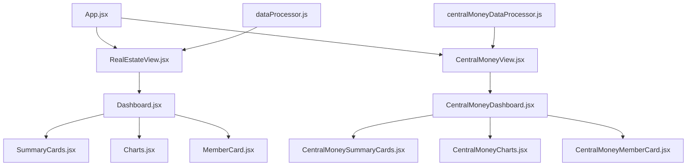

# System Patterns: Money Pink

## Architecture Overview
The application follows a clean React SPA pattern powered by **Vite** and styled using **Vanilla CSS Custom Properties (CSS variables)**. 

Data is fetched from separate Google Sheets endpoints through Google Apps Script macro URLs, processed on the client-side, and rendered in modular UI layers.

---

## Design System (Liquid Glass Theme)
Defined inside `src/index.css`, the theme utilizes CSS custom properties to maintain a uniform look:

* **Curated Pink Palette**:
  * `--bg-primary`: `#fdf2f8` (Very light pink)
  * `--text-primary`: `#831843` (Deep pink/burgundy for text)
  * `--accent-primary`: `#ec4899` / `--accent-secondary`: `#db2777`
* **Glassmorphism Spec**:
  * Card Background (`--bg-card`): `rgba(255, 255, 255, 0.45)` with `backdrop-filter: blur(24px) saturate(150%)`
  * Borders (`--border-color`): `rgba(255, 255, 255, 0.8)` with distinct top/left offsets (`1.5px solid rgba(255, 255, 255, 1)`) to simulate physical glass reflections.
* **Micro-interactions**:
  * Smooth translation transforms and dynamic shadow lifts on card hover (`.bg-card:hover`).
  * Shimmer glass effects (`glassShine` keyframe animation) running on cards to elevate premium quality.
  * Moving background liquid blobs (`body::before` and `body::after` styled with `blobFloat` keyframe transitions).

---

## Data Flow & Processing Patterns

### 1. Data Processing Pipeline
1. Fetch JSON array from external Google Apps Script.
2. Filter the raw array based on:
   * `selectedYear`
   * `selectedMember`
3. Map-reduce metrics using dedicated helpers (`dataProcessor.js` / `centralMoneyDataProcessor.js`).
4. Format dates and parse Thai Month abbreviations (`ม.ค.`, `ก.พ.`, etc.) to group timeline entries correctly.
5. Compute **Growth percentage (%)** compared to the previous calendar year.

### 2. Component Composition
* **View Layers (`*View.jsx`)**: Handle state (loading, error, raw data), API calls, year/member memoization, and growth metrics computation.
* **Dashboard Layers (`*Dashboard.jsx`)**: Orchestrate filters, reload triggers, screenshot capture refs, and clipboard image rendering.
* **Summary Cards (`*SummaryCards.jsx`)**: Render core KPI cards with up/down arrows and green/red growth status micro-badges.
* **Member Cards (`*MemberCard.jsx`)**: Render details for individuals, applying progress indicators and custom currency formatting.
* **Charts (`*Charts.jsx`)**: Set up responsive coordinate configurations using `Recharts` (`BarChart`, `AreaChart`, `LineChart`, `Tooltip`, `Legend`).
